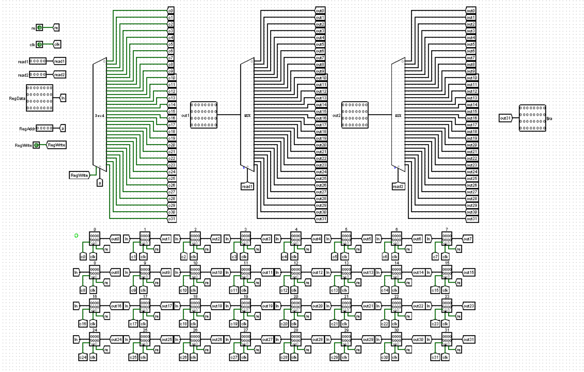
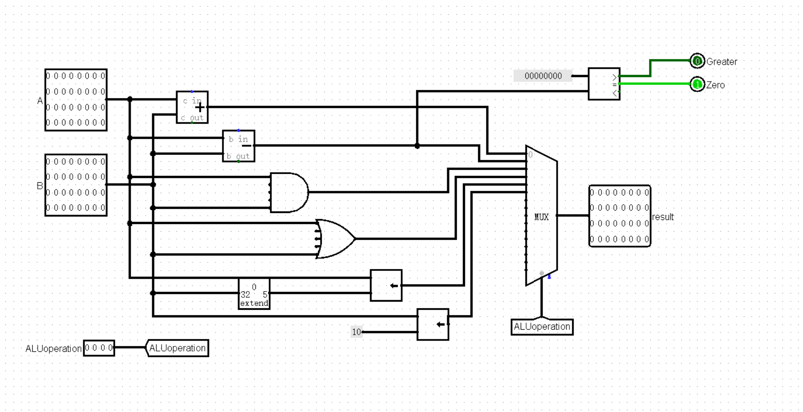
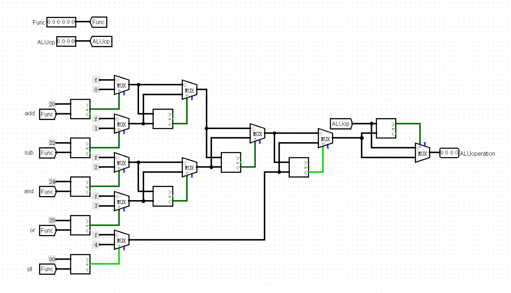
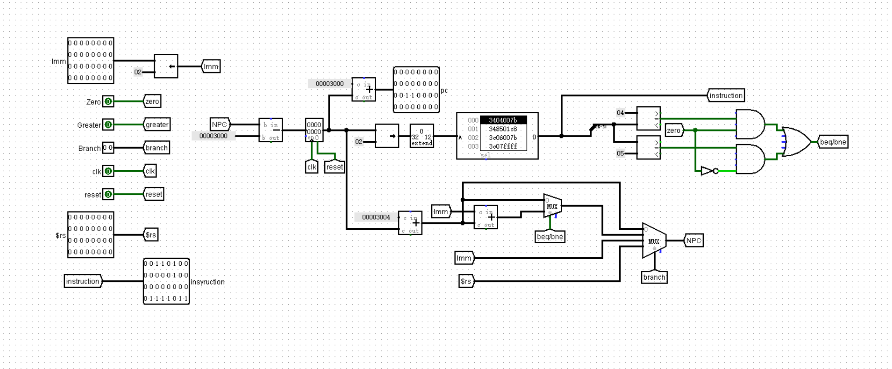
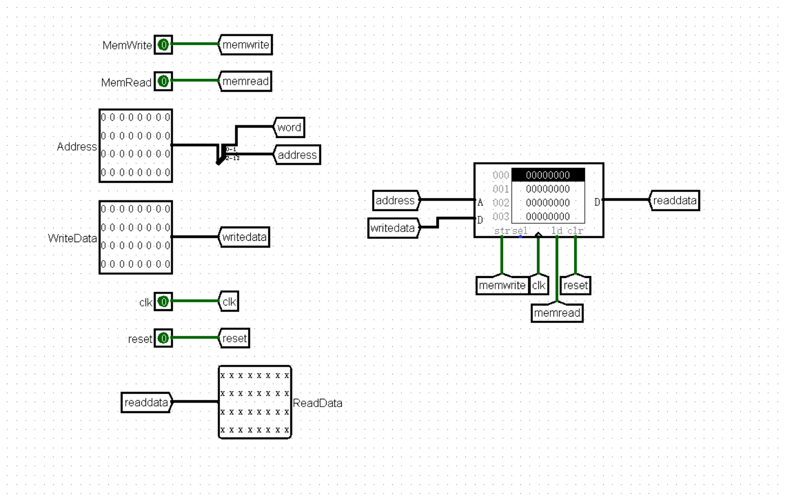
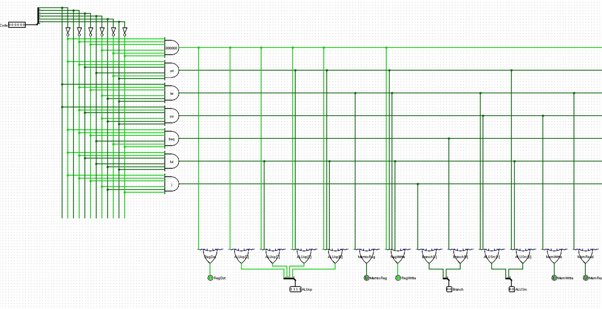

# CPU设计文档

## 思考题

> 1. 上面我们介绍了通过 FSM 理解单周期 CPU 的基本方法。请大家指出单周期 CPU 所用到的模块中，哪些发挥状态存储功能，哪些发挥状态转移功能。

对于单周期CPU，可以以 splitter 为界，将整个数据通路分成“上游”和“下游”两部分。

* “上游”可看做一个 Moore 型 FSM
**PC寄存器**发挥状态存储功能。  
**NPC模块**发挥状态转移功能。

* “下游”可以看做一个 Mealy 型 FSM。
**GRF、DM**发挥状态存储功能。  
**IFU、Splitter、Controller、ALU、MUX、EXT**发挥状态转移功能。

> 2. 现在我们的模块中 IM 使用 ROM，DM 使用 RAM，GRF 使用 Register，这种做法合理吗？ 请给出分析，若有改进意见也请一并给出。

**合理**。  
ROM是只读寄存器，且断电不会导致数据丢失。IM模块（指令存储器）只需读取寄存器中存储的指令，而不用修改其中的数据，因此选用ROM更安全稳定。  
RAM是随机访问存储器，DM（数据存储器）需要在使用CPU过程中读写数据，并且还具有异步复位的功能，使用RAM符合要求。  
GRF（通用寄存器组，也称为寄存器文件、寄存器堆）用具有写使能的寄存器实现，其作用类似于MIPS汇编中所使用的32个寄存器，作为进行逻辑运算的数据存储器，读写效率高。

> 3. 在上述提示的模块之外，你是否在实际实现时设计了其他的模块？如果是的话，请给出介绍和设计的思路。

> 4. 事实上，实现 nop 空指令，我们并不需要将它加入控制信号真值表，为什么？

---

## CPU设计方案

### 各模块端口说明与功能规定

#### GRF

##### 端口说明

|信号名|方向|
描述
|
|:---:|:--:|:-----|
|clk|I|时钟信号.|
|reset|I|异步复位信号.|
|Reg1 [4:0]|I|指定寄存器的5位地址，将目标寄存器的数据读出到 read1.|
|Reg2 [4:0]|I|指定寄存器的5位地址，将目标寄存器的数据读出到 read2.|
|RegWrite|I|GRF写入使能信号： `0` : 不能向GRF中写入数据; `1` : 可以向GRF中写入数据.|
|RegAddr [4:0]|I|GRF写入目标寄存器的5位地址.|
|RedData [31:0]|I|GRF写入的32位数据.|
|read1 [31:0]|O|输出Reg1指定的寄存器中的32位数据.|
|read2 [31:0]|O|输出Reg2指定的寄存器中的32位数据.|
|$ra [31:0]|O|输出寄存器$ra储存的32位数据.|

##### 功能规定

* **异步复位**：reset信号有效时将所有寄存器复位位0.
* **读取数据**：Reg1和Reg2信号可指定两个寄存器地址并读取其中数据，并通过端口read1,read2输出。
* **储存数据**：当写入使能信号RegWrite有效时，RedData输入的数据将在时钟信号上升沿时写入到RegAddr指定的寄存器中。

##### 电路实现

#### ALU

##### 端口说明

|信号名|方向|
描述
|
|:---:|:--:|:-----|
|A [31:0]|I|进行逻辑运算的第一个32位操作数.|
|B [31:0]|I|进行逻辑运算的第二个32位操作数.|
|ALUoperation [3:0]|I|由ALU控制单元输出的，指明ALU的运算类型. 详见[功能规定](#功能规定-1)|
|Zero|O|表示输入的两个操作数是否相等： `0` : 不相等； `1` : 相等.|
|Greater|O|表示输入的两个操作数的大小关系： `0` : A < B； `1` : A > B.|
|Result [31:0]|O|输出逻辑运算后的32位结果.|

##### 功能规定

* 根据ALU控制单元输出的ALUoperation信号对两个32位数据A、B进行算术逻辑运算。

  |ALUoperation [3:0]|功能|
  |:---:|:---:|
  |`0000`|执行`+`运算|
  |`0001`|执行`-`运算|
  |`0010`|执行`&`运算|
  |`0011`|执行`\|`运算|
  |`0100`|执行`逻辑左移`运算|
  |`0101`|执行`lui`运算|

##### 电路实现

#### ALU Control

##### 端口说明

|信号名|方向|
描述
|
|:---:|:--:|:-----|
|Func [6:0]|I|指令的Func字段(指令Func).|
|ALUop [3:0]|I|由主控单元生成的ALUop，指明ALU的运算类型: `1111` : R型指令，具体运算类型由Func字段决定； 其他详见[功能规定](#功能规定-1)|
|ALUoperation [3:0]|O|输出对ALU模块的控制信号，选择指定的运算结果.|

##### 功能规定

* 根据指令的Func字段和ALUop信号控制ALU的逻辑运算结果。
  
 |指令|Func字段|ALUop|ALU运算类型|ALUoperation|
 |:---:|:---:|:---:|:---:|:---:|
 |`lw`|`xxxxxx`|`0000`|`+`|`0000`|
 |`sw`|`xxxxxx`|`0000`|`+`|`0000`|
 |`beq`|`xxxxxx`|`0001`|`-`|`0001`|
 |`ori`|`xxxxxx`|`0011`|`\|`|`0011`|
 |`lui`|`xxxxxx`|`0101`|`<<16`|`0101`|
 |`add`|`100 000`|`1111`|`+`|`0000`|
 |`sub`|`100 010`|`1111`|`-`|`0001`|
 |`and`|`100 100`|`1111`|`&`|`0010`|
 |`or`|`100 101`|`1111`|`\|`|`0011`|
 |`sll`|`000 000`|`1111`|`<<`|`0100`|

##### 电路实现

#### IFU

##### 端口说明

|信号名|方向|
描述
|
|:---:|:--:|:-----|
|clk|I|时钟信号.|
|reset|I|异步复位信号.|
|Branch [1:0]|I|Controller输出的跳转类型. 详见[Controller](#controller)|
|Zero|I|ALU输出的判断值.|
|Greater|I|ALU输出的判断值.|
|Imm [31:0]|I|经过符号扩展的32位立即数.|
|$rs [31:0]|I|寄存器$rs的值.|
|Instruction [31:0]|O|当前的32位指令码.|

##### 功能规定

* 内部包括PC、IM及相关逻辑。
* 通过相关逻辑将程序计数器与ROM地址联系起来。
* 可以根据Controller输出的Branch控制信号、ALU输出的Zero判断结果执行跳转指令。

##### 电路实现

#### DM

##### 端口说明

|信号名|方向|
描述
|
|:---:|:--:|:-----|
|clk|I|时钟信号.|
|reset|I|异步复位信号.|
|MemWrite|I|写入使能信号: `0` : 不允许向RAM中写入数据; `1` : 允许向RAM中写入数据.|
|MemRead|I|读取使能信号 `0` : 不读取RAM中数据; `1` : 读取RAM中数据.|
|Address [31:0]|I|ALU输出的32位信号，当使能信号有效时作为数据读写的地址.|
|WriteData [31:0]|I|使能信号有效时，要写入RAM中的32位数据.|
|ReadData [31:0]|O|使能信号有效时，从RAM读取到的32位数据.|

##### 功能规定

* 可以根据Controller输出的MemRead、MemWrite控制信号，对数据存储器DM进行读写。

##### 电路实现

#### Controller

##### 端口说明

|信号名|方向|
描述
|
|:---:|:--:|:-----|
|OpCode [5:0]|I|指令的OpCode字段.|
|Branch [1:0]|O|决定跳转类型. `00` : 不跳转; `01` : 执行`beq`、`bne`类跳转指令; `10` : 执行`j`、`jal`类跳转指令; `11` : 执行`jr`、`jalr`类跳转指令.|
|MemtoReg|O|决定寄存器堆写入端数据来源: `0` : 来自ALU输出; `1` : 来自DM输出.|
|MemWrite|O|DM写入使能信号.|
|MemRead|O|DM读取使能信号.|
|ALUop [3:0]|O|指明ALU的运算类型. 详见[功能规定](#功能规定-1)|
|ALUSrc [1:0]|O|决定ALU输入端B数据来源: `0` : 选择GRF输出read2; `1` : 选择signext输出.|
|RegWrite|O|GRF写入使能信号.|
|RegDst|O|决定寄存器堆写入端地址: `0` : 选择rt字段; `1` : 选择rd字段.|

##### 电路实现

