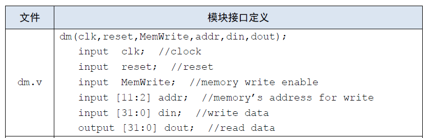

---
date:
    created: 2024-11-03
    updated: 2024-11-10
---

# CPU 设计文档 - P4

## 设计方案 - 各模块端口定义及功能说明

### GRF

#### 端口说明

|信号名|方向| <center>描述</center>              |
|:---:|:--:|:---------------------------------|
|clk|I| 时钟信号.                            |
|reset|I| 同步复位信号.                          |
|reg1 [4:0]|I| 指定寄存器的 5 位地址，将目标寄存器的数据读出到 read1. |
|reg2 [4:0]|I| 指定寄存器的 5 位地址，将目标寄存器的数据读出到 read2. |
|RegWrite|I| GRF 写入使能信号：有效时允许向 GRF 中写入.       |
|RegAddr [4:0]|I| GRF 写入目标寄存器的 5 位地址.              |
|RedData [31:0]|I| GRF 写入的 32 位数据.                  |
|read1 [31:0]|O| 输出 Reg1 指定的寄存器中的 32 位数据.         |
|read2 [31:0]|O| 输出 Reg2 指定的寄存器中的 32 位数据.         |

<!--|ra [31:0]|O|输出寄存器$ra储存的32位数据.|-->

#### 功能规定

* **同步复位**：reset 信号有效时，在 clk 上升沿将所有寄存器复位为0.
* **读取数据**：Reg1 和 Reg2 信号可指定两个寄存器地址并读取其中数据，并通过端口 read1 , read2 输出。
* **储存数据**：当写入使能信号 RegWrite 有效时，RedData 输入的数据将在时钟信号上升沿时写入到 RegAddr 指定的寄存器中。
<!-- * **&dollar;ra寄存器**：该模块将始终输出&dollar;ra寄存器的数据，为可能的跳转指令 -->

### ALU

#### 端口说明

|信号名|方向| <center>描述</center>                                                      |
|:---:|:--:|:-------------------------------------------------------------------------|
|a [31:0]|I| 进行逻辑运算的第一个 32 位操作数.                                                      |
|b [31:0]|I| 进行逻辑运算的第二个 32 位操作数.                                                      |
|Shamt [4:0]|I| 当前指令的 Shamt 字段.                                                          |
|ALUoperation [3:0]|I| 由 ALU 控制单元输出的，指明 ALU 的运算类型.<br><font color=grey>详见[功能规定](#功功能规定-ALUop)</font> |
|Judge [1:0]|O| 表示输入的两个操作数的大小关系：<br>`00` : 相等；<br>`01` : a < b；<br>`11` : a > b.         |
|Result [31:0]|O| 输出逻辑运算后的 32 位结果.                                                         |

<span id="功能规定-ALUop"></span>
#### 功能规定

* 根据ALU控制单元输出的ALUoperation信号对两个32位数据A、B进行算术逻辑运算。

  |ALUoperation [3:0]|功能|
  |:---:|:---:|
  |`0000`|执行`+`运算|
  |`0001`|执行`-`运算|
  |`0010`|执行`&`运算|
  |`0011`|执行`\|`运算|
  |`0100`|执行`加载至高位lui`运算|
  |`0101`|执行`逻辑左移sll`运算|
  |`0110`|执行`逻辑右移srl`运算|
  |`0111`|执行`算术右移sra`运算|

### IFU

#### 端口说明

|信号名|方向| <center>描述</center>                                              |
|:---:|:--:|:-----------------------------------------------------------------|
|clk|I| 时钟信号.                                                            |
|reset|I| 同步复位信号.                                                          |
|Branch [1:0]|I| Controller 输出的跳转类型.<br><font color=grey>详见[功能规定](#功能规定-Branch)</font> |
|Judge [1:0]|I| ALU 输出的判断值.                                                      |
|Imm [31:0]|I| 经过符号扩展的 32 位立即数.                                                 |
|ra [31:0]|I| 寄存器 $ra 的值.                                                      |
|Instruction [31:0]|O| 当前的 32 位指令码.                                                     |

<font color="red">**注意：**</font>**此处有误！**IFU 模块内输入端口 ra 本意是执行指令`jr $ra`时可以直接读取并跳转到寄存器 &dollar;ra 指向的地址。但是，**`jr`指令并不一定仅使用寄存器 &dollar;ra**,因此此处应该输入地址 rs 对应的寄存器中的值。  
<del>可以说，这是本人 P4 上机寄寄的原因，用了一个多小时才找到这个 bug，遗憾只做了两道题。</del>

<span id="功能规定-Branch"></span>
#### 功能规定

* 内部包括 PC、IM 及相关逻辑。
* 通过相关逻辑将程序计数器与 ROM 地址联系起来。
* 可以根据 Controller 输出的 Branch 控制信号、ALU 输出的 Judge 判断结果执行跳转指令。
  
  |Branch [1:0]|           跳转类型           |指令示例|
  |:---:|:------------------------:|:---:|
  |`00`|           不跳转.           | \ |
  |`01`|     跳转到 Imm 指定的偏移量.      |`beq`|
  |`10`|      跳转到 Imm 指定的地址.      |`jal`|
  |`11`| 跳转到寄存器 &dollar;ra 指定的地址. |`jr`|

### DM

#### 端口说明

|信号名|方向| <center>描述</center>                                      |
|:---:|:--:|:---------------------------------------------------------|
|clk|I| 时钟信号.                                                    |
|reset|I| 异步复位信号.                                                  |
|MemWrite|I| 写入使能信号:<br>`0` : 不允许向 RAM 中写入数据;<br>`1` : 允许向 RAM 中写入数据. |
|MemRead|I| 读取使能信号<br>`0` : 不读取 RAM 中数据;<br>`1` : 读取 RAM 中数据.        |
|Address [31:0]|I| ALU 输出的 32 位信号，当使能信号有效时作为数据读写的地址.                        |
|WriteData [31:0]|I| 使能信号有效时，要写入 RAM 中的 32 位数据.                               |
|ReadData [31:0]|O| 使能信号有效时，从 RAM 读取到的 32 位数据.                               |

#### 功能规定

* 可以根据 Controller 输出的 MemRead、MemWrite 控制信号，对数据存储器 DM 进行读写。

### Controller

#### 端口说明

|信号名|方向| <center>描述</center>                                                                                     |
|:---:|:--:|:--------------------------------------------------------------------------------------------------------|
|OpCode [5:0]|I| 指令的 OpCode 字段.                                                                                          |
|Func [5:0]|I| 指令的 Func 字段.                                                                                            |
|ALUop [3:0]|O| 指明 ALU 的运算类型.<br><font color=grey>详见[功能规定 - ALUop](#功能规定-ALUop)</font>                                  |
|ALUSrc [1:0]|O| 决定 ALU 输入端 B 数据来源:<br>`00` : 选择 GRF 输出 read2(rt 寄存器);<br>`01` : 选择 zeroext 输出;<br>`10` : 选择 signext 输出. |
|Branch [1:0]|O| 决定跳转类型.<br><font color=grey>详见[功能规定 - Branch](#功能规定-Branch)</font>                                      |
|MemWrite|O| DM 写入使能信号.                                                                                              |
|MemRead|O| DM 读取使能信号.                                                                                              |
|RegWrite|O| GRF 写入使能信号.                                                                                             |
|RegDst [1:0]|O| 决定寄存器堆写入端地址:<br>`00` : 选择 rt 字段;<br>`01` : 选择 rd 字段;<br>`10` : 选择寄存器 &dollar;ra.                        |
|MemtoReg [1:0]|O| 决定寄存器堆写入端数据来源:<br>`00` : 来自 ALU 输出;<br>`01` : 来自 DM 输出;<br>`10` : 来自 IFU 输出.                            |
|MemtoDM|O| 决定内存写入端数据来源:<br>`0` : 寄存器 rt 的值.                                                                        |

---

## 思考题

> 1 . 阅读下面给出的 DM 的输入示例中（示例 DM 容量为 4KB，即 32bit × 1024字），根据你的理解回答，这个 addr 信号又是从哪里来的？地址信号 addr 位数为什么是 [11:2] 而不是 [9:0] ？
> 

addr 表示内存 DM 读写的地址，其来源于 ALU 模块的输出信号。其位宽采用 [11:2] 而非 [9:0] 是因为在 CPU 指令中，地址采用字节寻址，二我们设计的内存是由多个 32 位寄存器组成的，四字节为一字，故要忽略后两位。 

> 2 . 思考上述两种控制器设计的译码方式，给出代码示例，并尝试对比各方式的优劣。
>
> > *...可以记录下**指令对应的控制信号如何取值**，也可以记录下**控制信号每种取值所对应的指令**，在后面的 Project 中，这两种不同的译码方式将展现出各自的优劣...*

代码示例：  
**指令：**

```verilog
if(OpCode==6'b000000)
  begin
   MemWrite<=0;
   MemRead<=0;
   MemtoDM<=0;//
   if(Func==6'b000000)//sll
   begin
    Branch<=0;
    RegWrite<=1;
    MemtoReg<=0;
    ALUop<=4'b0101;
    ALUSrc<=0;
    RegDst<=1;
   end else if(Func==6'b100000)//add
   begin
    //...
   end
  end else if(OpCode==6'b001101)//ori
  begin
   Branch<=0;
   MemWrite<=0;
   MemRead<=0;
   //...
  end
```

**控制信号：**

```verilog
assign ALUOp = (add | lw | sw) ? 4'b0000 :
               (subu) ? 4'b0001 :
               (ori) ? 4'b0011 :
               (lui) ? 4'b0100 : 4'b0000;
```

两种控制器设计方法各有优劣，根据指令设计控制信号可以更便捷的增删指令，而根据控制信号选择指令更容易把握指令功能，减少出错。

> 3 . 在相应的部件中，复位信号的设计都是同步复位，这与 P3 中的设计要求不同。请对比同步复位与异步复位这两种方式的 reset 信号与 clk 信号优先级的关系。

对于同步复位，clk的优先级更高；对于异步复位，reset优先级更高。

> 4 . C 语言是一种弱类型程序设计语言。C 语言中不对计算结果溢出进行处理，这意味着 C 语言要求程序员必须很清楚计算结果是否会导致溢出。因此，如果仅仅支持 C 语言，MIPS 指令的所有计算指令均可以忽略溢出。 请说明为什么在忽略溢出的前提下，addi 与 addiu 是等价的，add 与 addu 是等价的。提示：阅读[《MIPS32® Architecture For Programmers Volume II: The MIPS32® Instruction Set》](resource/P4_exercise/MIPS_Vol2_指令集.pdf)中相关指令的 Operation 部分。

根据指令描述，`addi` 与 `addiu` 的区别在于，`addi` 会记录 GPR[rs] 的最高位，在 `+` 运算结束后对最高位进行比较，如果最高位不同（即溢出）则会 `SignalException(IntegerOverflow)` 报错，但 `addiu` 不考虑这些。`add` 与 `addu` 同理。

---

## 测试方案

自编测试代码：
```verilog
.text
ori $1,$1,20
ori $2,$2,10
add $3,$2,$1
sub $4,$1,$2
sw $4,($1)
lw $5,($1)
beq $4,$5,aaa
lui $6,6
aaa:
jal tag
add $7,$7,$2
tag:
beq $7,$1,end
jr $ra
end:
```