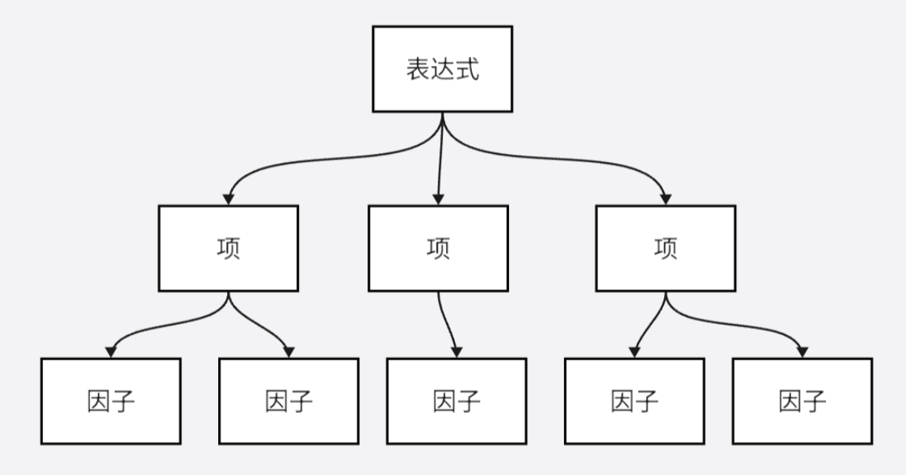

# 架构设计

分析作业内容，本次作业的核心包含两个方面：**文法分析**和**表达式计算**。

## 文法分析 (Grammatical Analysis)

文法（Grammar），作为对语言结构的精准定义与全面描述，其核心在于通过形式化的规则体系来规约语言的构造法则。简而言之，文法即是语言的框架与规范。

对于本次作业而言，我们要分析的即为表达式。根据题目描述中表达式、项、因子的构成方式，我们可以很清晰的刻画出他们之间的逻辑关系，
并据此通过 **Parser**（语法分析器）和 **Lexer**（词法分析器）对 **Expression** （表达式）进行分析，从而获得其构成内容 **Term** （项），以及更下一层的 **Factor**（因子）。

### 词法分析 LEXER

**词法分析**的逻辑是，程序通过依次读取字符串中的每一个字母，并依据当前字母与已知词类开头字母的对应关系，来逐步构建并识别出完整的词汇及其所属词类。
这种方法不仅逻辑清晰，而且在实际应用中具有高度的可操作性和准确性。

**token** 作为文本的最小语法单位，常被用于表示和处理文本数据。在此场景下，**token** 可作为存储字符串经词法分析后所得单元的适宜载体。
换言之，**Lexer** 将分析结果以 **token** 为单位与 **Parser** 交互，语法分析的任务将聚焦于 **token** 之上，而非原始的字符串数据。

### 语法分析 PARSER
语法分析即依据“语法”，也就是题目中所说的各个结构的构成规则，对 **token** 进行**分类、分层次**地存储。
这种存储将展示各个语法组件的复杂关联，例如下图：

语法分析的目的，就是生成一个这样的树，它用节点之间的联系来表达原本表达式的语法结构。这种树一般被称为语法树（Syntax Tree）或抽象语法树（Abstract Syntax Tree，AST）。

接下来，将这一抽象概念转化为具体的代码实现。为此，需要定义几个类，以构建出构成语法树的基本节点。这些节点将分别对应于表达式（Expr）、项（Term）以及因子（Factor）。

重要的设计思路：**从全局到局部**，**递归下降**。

* **从全局到局部** ：Java 设计的重要特点就在于封装。以题目为例，如果以全局的视角观察表达式，将会得到异常复杂的语法树：表达式由各种项构成，而项又由多个因子构成，包括变量因子、整数因子以及表达式因子。
而表达式因子又由多个项构成......其中充斥着大量的内容和不同的构成规则，对于程序设计即为不友好。

    因此，“局部”地看待问题，将“局部”以外的内容所涉及的计算、方法当做已经解决的内容，直接调用相应的方法，而忽略其具体的解决步骤。

    **选择合适的局部视角，合理的屏蔽细节，将具体的实现封装，是让代码高效且清晰的重要手段。**

* **递归下降** ：本题中体现的并不明显。但是，如果面临多层括号嵌套且层数无限制的问题，如果仅仅采用简单循环的方式将很难解决问题。
    通过递归调用文法分析器中表达式的分析方法 parseExpr 将会很快捷地解决问题。

### 一次失败的设计
关于表达式拆括号与恒等变形的问题，本质上就是加减乘的数学计算。然而，当一个项包含多个表达式因子，即有**多层括号**，或者说存在**指数较大的表达式因子**时，以何种递归（或循环）逻辑计算便是很重要的。
如果采用不合理的算法，很容易导致**栈空间溢出**、**内存溢出**和**运行时间过长**等问题。

在初完成作业时，我设计了一种自认为很机智的循环逻辑：首先获得对输入进行文法分析后获得的表达式，然后对其中的项进行遍历，对每一个项进行拆括号的计算。
对于每一个项 term ，首先遍历其所有因子，如果没有表达式因子，则 `return term` （跳出，返回项）。如果遍历到一个表达式因子 expr ，则在 term 中“删除”因子 expr （对于指数不为 1 的 expr 有进一步的处理），
并将其他因子记为 term2 。随后，对 expr 的每一项 exprTerm 进行遍历，并分别与 term2 相乘。当然，项与项相乘并不复杂，就是将其中因子的集合相加即可。获得项的集合，并递归调用该方法。

不知读者是否意识到其中的问题。似乎这种拆括号算法非常符合正常的数学运算思路，而且十分简便，每次只要找到一个表达式因子，并且其他因子都不需要变化，从程序设计角度非常容易实现。但是，如若仔细思考便会发现问题：按照上述思路，
一项中包含`n`个表达式因子（指数为`a`的表达式因子记为`a`个），那就要进行 **n 层**递归,也就是要计算 $\prod p_i$ 次（$p_i$ 指第$i$个表达式因子的项数）！

简单举例：如果某项为 `(x+2-x^2)*(x+1)*(x-3)` ，第一层计算后得到 `x*(x+1)*(x-3) + 2**(x+1)*(x-3) + -x^2*(x+1)*(x-3)` ，对于每一项，还要再进行拆分，直到获得没有表达式因子的项。

在中测结束后，我很快意识到其中的问题，并重新设计了去括号的方法。显然，`n`个表达式因子进行`n`次计算是合理的。也就是说，应采取更直接的拆括号算法来避免过深层的递归。
例如，面对一个项 `(x+1)*(x-4)*4*x^2` ，对于遍历得到的第一个表达式因子 `(x+1)` ，将之直接与下一个因子相乘，获得 `(x^2+x-4*x-4)` ，并以此继续进行计算，直至不含有表达式因子。

此外，需要说明的是，面对直接拆括号的算法，多次对表达式因子进行简化、合并同类项是相当有必要的。如果表达式因子中有太多项，依旧会大幅影响程序效率。递归调用
表达式的简化方法，既可以优化效率，也可以同步处理未来可能存在的多层括号问题。